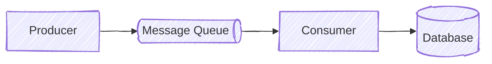

# Mermaid architecture diagrams

Create architecture diagrams that emphasize relationships and remain readable across supported Mermaid renderers.

## Create or revise a diagram

1. Identify the components and relationships that the diagram must communicate.
2. Prefer a generic `flowchart` unless another Mermaid diagram type expresses the architecture more clearly.
3. Choose the flow direction deliberately; `LR` is often suitable for processing or dependency flows.
4. Prefer Mermaid's hand-drawn look for an approachable, discussion-oriented architecture diagram:

   ```mermaid
   ---
   config:
     look: handDrawn
   ---
   ```

   Use another look when hand-drawn rendering conflicts with an external design system, reduces clarity, requires precise alignment, or renders poorly in the required output.
5. Define elements with concise, human-readable labels and semantic shapes before declaring their relationships.
6. Add edges after the element definitions so the structure remains easy to scan and edit.
7. Add comments only for non-obvious modeling choices. Put every `%%` comment on its own line; never append one to a statement and never put comments inside configuration frontmatter.

Use established shapes where applicable:

- Database: `db[(Database)]`
- Message queue: `queue@{ label: "Message Queue", shape: das }`

## Renderer compatibility

Treat renderers in this priority order:

1. Mermaid CLI (`mmdc`) defines the intended presentation.
2. GitHub Markdown Mermaid rendering must still parse, render, and communicate the content clearly.
3. The Code Mermaid Preview plugin must also parse, render, and communicate the content clearly.

Lower-priority renderers may omit optional aesthetics such as hand-drawn styling or icons. Do not use an enhancement if it prevents the diagram from parsing or communicating clearly in a supported renderer.

## Render and validate

- Render with `mmdc` when it is available, for example `mmdc -i diagram.mmd -o diagram.svg`, and visually inspect labels, layout, edges, and shapes. Hand-drawn output can vary between Mermaid versions and tools.
- Prefer SVG for rendered artifacts because it remains sharp and inspectable. Generate PNG only when the target environment cannot accept SVG.
- Confirm every referenced node is defined and every rendered relationship matches the intended architecture.
- Check GitHub Markdown and the Code Mermaid Preview plugin when those renderers are available. Aesthetic differences are acceptable; parse failures and unclear content are not.

## Example


