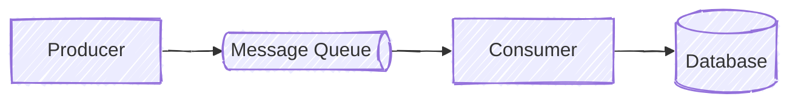

# Mermaid architecture diagrams

Create Mermaid diagrams that communicate architectural relationships clearly and feel open to discussion and revision.

## Workflow

1. Identify the components and relationships that the diagram must communicate.
2. Prefer a generic `flowchart` unless another Mermaid diagram type expresses the architecture more clearly.
3. Choose the flow direction deliberately; use `LR` for left-to-right processing or dependency flows when appropriate.
4. Add Mermaid frontmatter that selects the hand-drawn look:

   ```mermaid
   ---
   config:
     look: handDrawn
   ---
   ```

5. Define each element with its label and semantic shape before declaring relationships.
6. Add edges after the element definitions so the structure remains easy to scan and edit.
7. Render or preview the diagram and visually verify labels, layout, edges, and shapes in the target Mermaid tool.

## Modeling conventions

- Use concise, human-readable labels that describe architectural roles.
- Represent databases with Mermaid's cylinder syntax, such as `db[(Database)]`.
- Represent message queues with the `das` shape, such as `queue@{ label: "Message Queue", shape: das }`.
- Add comments only when they preserve a non-obvious modeling choice.
- Prefer the hand-drawn look for architecture diagrams, but treat it as a preference rather than an absolute requirement.

Use a different look when hand-drawn rendering conflicts with an external design system, reduces clarity for a complex or compact diagram, requires overly precise alignment, or renders poorly in the required publication format. When deviating, optimize for legibility and the target output.

## Example



## Validation

- Confirm that the Mermaid source parses in the target renderer.
- Confirm that every referenced node is explicitly defined.
- Check that the rendered relationships match the intended architecture.
- Visually inspect exported output because hand-drawn rendering may vary between Mermaid versions and tools.
